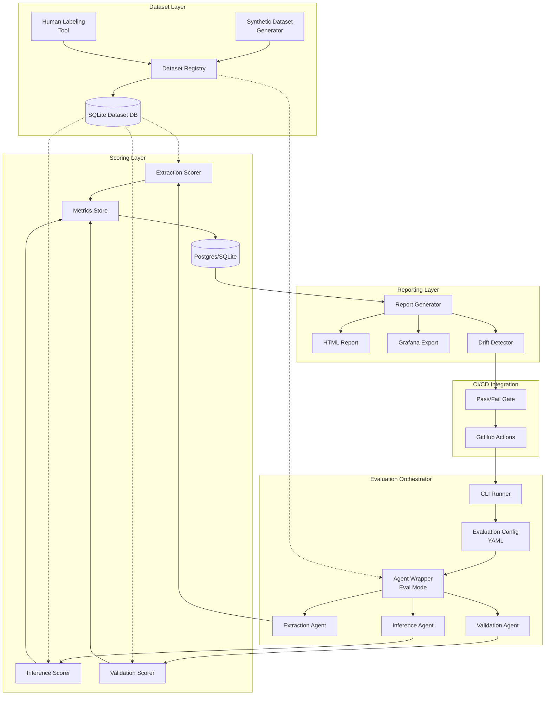
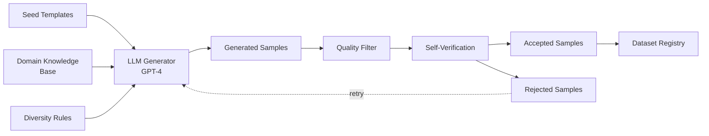

# Design Packet 5: Evaluation, Benchmarking, Synthetic Data & Continuous Quality
## Multi-Agent Requirements Engineering Platform

**Version:** 5.0
**Date:** November 16, 2025
**Scope:** Comprehensive evaluation infrastructure, automated quality assurance, synthetic data generation
**Prerequisites:** Design Packets 1, 2, 3, 4

---

# Table of Contents

1. [Executive Summary](#1-executive-summary)
2. [Full Evaluation Framework Architecture](#2-full-evaluation-framework-architecture)
3. [Synthetic Dataset Generation](#3-synthetic-dataset-generation)
4. [Gold Standard Dataset](#4-gold-standard-dataset)
5. [Evaluation Metrics](#5-evaluation-metrics)
6. [Evaluation Pipeline Implementation](#6-evaluation-pipeline-implementation)
7. [Continuous Evaluation in CI/CD](#7-continuous-evaluation-in-cicd)
8. [Local Developer Evaluation Tools](#8-local-developer-evaluation-tools)
9. [Dataset Versioning & Governance](#9-dataset-versioning--governance)
10. [Embedded Artifacts](#10-embedded-artifacts)

---

## 1. Executive Summary

### 1.1 Purpose of Design Packet 5

Design Packet 5 establishes a comprehensive evaluation infrastructure for the Multi-Agent Requirements Engineering Platform, enabling:

**Automated Quality Assurance:**[149][152][155]
- Continuous monitoring of extraction, inference, and validation agent performance
- Early detection of model degradation and prompt drift
- Regression prevention through automated baseline comparison

**Data-Driven Development:**[150][153][156]
- Synthetic dataset generation for rapid experimentation
- Human-labeled gold standard for ground truth validation
- Systematic error analysis and improvement cycles

**Production Confidence:**
- Pre-deployment quality gates in CI/CD
- Real-time performance tracking
- Evidence-based decision making for model updates

### 1.2 Integration with Design Packets 1-4

| Packet | Connects via Packet 5 |
|--------|----------------------|
| **Packet 1** | Agent architecture validated through systematic evaluation |
| **Packet 2** | Backend LangGraph nodes instrumented for eval mode |
| **Packet 3** | Frontend metrics feed into evaluation reports |
| **Packet 4** | CI/CD pipeline integrates automated evaluation gates |

**Key Integration Points:**
- Extraction agent (Packet 2) → Extraction metrics (Packet 5)
- Inference agent (Packet 2) → Inference quality scoring (Packet 5)
- Validation agent (Packet 2) → Validation accuracy metrics (Packet 5)
- Observability metrics (Packet 4) → Continuous eval monitoring (Packet 5)

### 1.3 Why Evaluation is Critical

**For Requirement Extraction Agent:**[149][152]
- Precision: Are extracted requirements actually requirements?
- Recall: Are we missing requirements from the conversation?
- Completeness: Do acceptance criteria cover all aspects?
- Type accuracy: Correct classification (functional/non-functional/security)?

**For Inference Agent:**
- Relevance: Are inferred requirements actually needed?
- False inference rate: How often do we infer unnecessary requirements?
- Confidence calibration: Does 80% confidence mean 80% correct?[151][154][157]

**For Validation Agent:**
- Issue detection: Do we catch ambiguous verbs, missing actors?
- False positives: Do we flag correct requirements as problematic?
- PII detection: Do we identify sensitive data leakage?

**End-to-End System:**
- RD quality: Is the generated document useful and correct?
- Human-in-loop effectiveness: Do reviewer interventions improve quality?
- Time efficiency: How long to first correct RD version?

---

## 2. Full Evaluation Framework Architecture

### 2.1 System Architecture



### 2.2 Component Specifications

#### 2.2.1 Evaluation Pipeline Orchestrator

**Responsibilities:**
- Load evaluation datasets (synthetic or gold)
- Initialize agent wrappers in deterministic mode
- Execute agents on test samples
- Collect predictions and intermediate outputs
- Route to appropriate scorers
- Aggregate results into reports

**Configuration:**
```yaml
# eval/configs/full-pipeline-eval.yaml
name: "full-pipeline-evaluation"
version: "1.0.0"

datasets:
  extraction:
    path: "datasets/synthetic/extraction_v1.2.jsonl"
    split: "test"
    size: 500

  inference:
    path: "datasets/synthetic/inference_v1.1.jsonl"
    split: "test"
    size: 300

  validation:
    path: "datasets/gold/validation_v1.0.jsonl"
    split: "test"
    size: 150

agents:
  extraction:
    temperature: 0.0  # Deterministic
    max_tokens: 2000
    cache_enabled: true

  inference:
    temperature: 0.0
    max_tokens: 1500

  validation:
    temperature: 0.0
    max_tokens: 1000

metrics:
  extraction:
    - requirement_recall
    - requirement_precision
    - acceptance_criteria_completeness
    - type_accuracy
    - confidence_calibration

  inference:
    - relevance_score
    - false_inference_rate
    - confidence_accuracy_curve

  validation:
    - issue_detection_recall
    - issue_detection_precision
    - pii_detection_f1
    - severity_accuracy

thresholds:
  extraction_precision: 0.85
  extraction_recall: 0.80
  inference_false_rate: 0.15
  validation_recall: 0.90

reporting:
  output_dir: "reports/"
  formats: ["html", "json", "markdown"]
  include_error_samples: 10
  include_calibration_curves: true
```

#### 2.2.2 Dataset Registry

**Schema:**
```sql
CREATE TABLE datasets (
    id TEXT PRIMARY KEY,
    name TEXT NOT NULL,
    version TEXT NOT NULL,
    type TEXT NOT NULL,  -- 'synthetic' or 'gold'
    agent_target TEXT NOT NULL,  -- 'extraction', 'inference', 'validation', 'end-to-end'
    created_at TIMESTAMP DEFAULT CURRENT_TIMESTAMP,
    num_samples INTEGER,
    metadata JSON,
    file_path TEXT,
    checksum TEXT
);

CREATE TABLE dataset_samples (
    id TEXT PRIMARY KEY,
    dataset_id TEXT REFERENCES datasets(id),
    sample_index INTEGER,
    input_data JSON,
    ground_truth JSON,
    metadata JSON,
    difficulty TEXT  -- 'easy', 'medium', 'hard'
);

CREATE TABLE evaluation_runs (
    id TEXT PRIMARY KEY,
    config_name TEXT,
    dataset_id TEXT REFERENCES datasets(id),
    started_at TIMESTAMP,
    completed_at TIMESTAMP,
    status TEXT,  -- 'running', 'completed', 'failed'
    git_commit TEXT,
    model_version TEXT,
    metrics JSON
);

CREATE TABLE evaluation_results (
    id TEXT PRIMARY KEY,
    run_id TEXT REFERENCES evaluation_runs(id),
    sample_id TEXT REFERENCES dataset_samples(id),
    agent_name TEXT,
    prediction JSON,
    ground_truth JSON,
    scores JSON,
    passed BOOLEAN,
    error TEXT
);
```

#### 2.2.3 Metrics Store

**Metrics Schema:**
```python
from dataclasses import dataclass
from typing import Dict, List, Optional
from datetime import datetime

@dataclass
class MetricValue:
    name: str
    value: float
    timestamp: datetime
    run_id: str
    agent: str
    metadata: Optional[Dict] = None

@dataclass
class CalibrationBin:
    predicted_prob_range: tuple  # (0.0-0.1, 0.1-0.2, etc.)
    predicted_prob_mean: float
    actual_frequency: float
    count: int

@dataclass
class MetricsSummary:
    run_id: str
    timestamp: datetime
    overall_metrics: Dict[str, float]
    per_agent_metrics: Dict[str, Dict[str, float]]
    calibration_data: Dict[str, List[CalibrationBin]]
    confusion_matrices: Dict[str, List[List[int]]]
    sample_errors: List[Dict]
```

---

## 3. Synthetic Dataset Generation (LLM-Assisted)

### 3.1 Synthetic Data Architecture



### 3.2 Requirement Extraction Dataset Generation[150][153][156][159]

**Generator Logic:**

```python
# dataset-generator.py (Extraction portion)
import openai
import json
from typing import List, Dict
import random

EXTRACTION_TEMPLATES = [
    {
        "domain": "e-commerce",
        "conversation_starters": [
            "We need a shopping cart system",
            "Users should be able to browse products",
            "Build an online store with payment processing"
        ],
        "expected_requirement_types": ["functional", "non-functional", "security", "data"]
    },
    {
        "domain": "healthcare",
        "conversation_starters": [
            "Build a patient portal",
            "Doctors need to view patient records",
            "Create an appointment scheduling system"
        ],
        "expected_requirement_types": ["functional", "security", "data", "compliance"]
    },
    {
        "domain": "fintech",
        "conversation_starters": [
            "We need a money transfer feature",
            "Build a budgeting tool",
            "Create a trading platform"
        ],
        "expected_requirement_types": ["functional", "security", "non-functional", "compliance"]
    }
]

def generate_extraction_sample(template: Dict, difficulty: str) -> Dict:
    \"\"\"
    Generate a single requirement extraction test case

    Args:
        template: Domain template with conversation starters
        difficulty: 'easy', 'medium', 'hard'

    Returns:
        Dictionary with input conversation and ground truth requirements
    \"\"\"

    # Adjust complexity based on difficulty
    if difficulty == "easy":
        num_messages = random.randint(2, 4)
        num_requirements = random.randint(1, 3)
        ambiguity_level = "low"
    elif difficulty == "medium":
        num_messages = random.randint(4, 8)
        num_requirements = random.randint(3, 6)
        ambiguity_level = "medium"
    else:  # hard
        num_messages = random.randint(8, 15)
        num_requirements = random.randint(6, 12)
        ambiguity_level = "high"

    # Generate conversation using LLM
    conversation_prompt = f\"\"\"
Generate a realistic requirements gathering conversation for a {template['domain']} system.

Difficulty: {difficulty}
Number of messages: {num_messages}
Ambiguity level: {ambiguity_level}
Expected requirements: {num_requirements}

The conversation should:
1. Start with: "{random.choice(template['conversation_starters'])}"
2. Include both user messages and analyst clarifying questions
3. Gradually reveal {num_requirements} distinct requirements
4. Include requirement types from: {template['expected_requirement_types']}
5. For difficulty '{difficulty}', use {'clear, explicit language' if difficulty == 'easy' else 'some implicit needs' if difficulty == 'medium' else 'vague descriptions requiring inference'}

Output format:
{{
  "conversation": [
    {{"role": "user", "content": "..."}},
    {{"role": "analyst", "content": "..."}},
    ...
  ],
  "ground_truth_requirements": [
    {{
      "id": "REQ-001",
      "title": "...",
      "type": "functional",
      "actor": "User",
      "action": "...",
      "condition": null,
      "acceptance_criteria": ["...", "..."],
      "priority": "must",
      "confidence": 1.0,
      "source_messages": [0, 2],
      "rationale": "Explicit user request in message 0"
    }},
    ...
  ],
  "difficulty_justification": "..."
}}
\"\"\"

    response = openai.ChatCompletion.create(
        model="gpt-4-turbo-preview",
        messages=[
            {"role": "system", "content": "You are an expert at generating synthetic training data for requirement extraction systems."},
            {"role": "user", "content": conversation_prompt}
        ],
        temperature=0.7,
        response_format={"type": "json_object"}
    )

    sample = json.loads(response.choices[0].message.content)

    # Self-verification step
    if not verify_sample_quality(sample, num_requirements, difficulty):
        # Regenerate if quality check fails
        return generate_extraction_sample(template, difficulty)

    return sample

def verify_sample_quality(sample: Dict, expected_reqs: int, difficulty: str) -> bool:
    \"\"\"
    Verify generated sample meets quality standards
    \"\"\"

    # Check: Has conversation
    if len(sample.get("conversation", [])) < 2:
        return False

    # Check: Has requirements
    reqs = sample.get("ground_truth_requirements", [])
    if len(reqs) < max(1, expected_reqs - 2):  # Allow some variance
        return False

    # Check: All requirements have required fields
    for req in reqs:
        required_fields = ["id", "title", "type", "actor", "action", "acceptance_criteria", "source_messages"]
        if not all(field in req for field in required_fields):
            return False

        # Check: Acceptance criteria not empty
        if not req["acceptance_criteria"]:
            return False

        # Check: Source messages exist in conversation
        if not all(0 <= idx < len(sample["conversation"]) for idx in req["source_messages"]):
            return False

    # Check: Difficulty-specific validations
    if difficulty == "hard":
        # Hard samples should have some complex requirements
        complex_count = sum(1 for r in reqs if len(r["acceptance_criteria"]) >= 4)
        if complex_count == 0:
            return False

    return True

def generate_extraction_dataset(
    num_samples: int,
    difficulty_distribution: Dict[str, float] = {"easy": 0.3, "medium": 0.5, "hard": 0.2}
) -> List[Dict]:
    \"\"\"
    Generate full extraction dataset

    Args:
        num_samples: Total number of samples to generate
        difficulty_distribution: Distribution of difficulty levels

    Returns:
        List of generated samples
    \"\"\"

    dataset = []

    # Calculate samples per difficulty
    difficulty_counts = {
        level: int(num_samples * ratio)
        for level, ratio in difficulty_distribution.items()
    }

    for difficulty, count in difficulty_counts.items():
        print(f"Generating {count} {difficulty} samples...")

        for i in range(count):
            template = random.choice(EXTRACTION_TEMPLATES)
            sample = generate_extraction_sample(template, difficulty)

            # Add metadata
            sample["metadata"] = {
                "difficulty": difficulty,
                "domain": template["domain"],
                "generated_at": datetime.utcnow().isoformat(),
                "generator_model": "gpt-4-turbo-preview",
                "verified": True
            }

            dataset.append(sample)

            if (i + 1) % 10 == 0:
                print(f"  Generated {i + 1}/{count}")

    return dataset
```

**Example Generated Sample:**

```json
{
  "conversation": [
    {
      "role": "user",
      "content": "We need a shopping cart system for our e-commerce site"
    },
    {
      "role": "analyst",
      "content": "What should happen when users add items to their cart?"
    },
    {
      "role": "user",
      "content": "They should see the item appear immediately, with quantity and total price. Users should be able to update quantities or remove items."
    },
    {
      "role": "analyst",
      "content": "Should the cart persist if the user leaves and comes back?"
    },
    {
      "role": "user",
      "content": "Yes, for logged-in users, save their cart for at least 30 days"
    }
  ],
  "ground_truth_requirements": [
    {
      "id": "REQ-001",
      "title": "Add Item to Cart",
      "type": "functional",
      "actor": "User",
      "action": "Add a product to shopping cart with immediate visual feedback",
      "condition": null,
      "acceptance_criteria": [
        "Item appears in cart immediately after clicking Add to Cart",
        "Cart displays item name, quantity, unit price, and line total",
        "Cart shows updated subtotal including new item"
      ],
      "priority": "must",
      "confidence": 1.0,
      "source_messages": [0, 2],
      "rationale": "Explicit requirement stated by user in messages 0 and 2"
    },
    {
      "id": "REQ-002",
      "title": "Update Cart Quantities",
      "type": "functional",
      "actor": "User",
      "action": "Modify quantity of items in cart or remove items entirely",
      "condition": "Item is already in cart",
      "acceptance_criteria": [
        "User can increase or decrease quantity",
        "User can remove item by setting quantity to 0 or clicking remove button",
        "Cart totals update immediately after change",
        "Changes persist across page refreshes for logged-in users"
      ],
      "priority": "must",
      "confidence": 1.0,
      "source_messages": [2],
      "rationale": "Explicitly requested functionality in message 2"
    },
    {
      "id": "REQ-003",
      "title": "Persistent Cart for Logged-In Users",
      "type": "non-functional",
      "actor": "System",
      "action": "Preserve shopping cart contents for authenticated users across sessions",
      "condition": "User is logged in",
      "acceptance_criteria": [
        "Cart contents saved to database when user is authenticated",
        "Cart restored when user logs back in",
        "Cart persisted for minimum 30 days",
        "Cart cleared after 30 days of inactivity"
      ],
      "priority": "must",
      "confidence": 1.0,
      "source_messages": [4],
      "rationale": "Explicit persistence requirement with 30-day retention specified"
    }
  ],
  "difficulty_justification": "Medium difficulty - requires extracting 3 requirements from conversation, with some implicit details (like cart total updates) that need to be inferred from context",
  "metadata": {
    "difficulty": "medium",
    "domain": "e-commerce",
    "generated_at": "2025-11-16T12:00:00Z",
    "generator_model": "gpt-4-turbo-preview",
    "verified": true
  }
}
```

### 3.3 Inference Dataset Generation[150][159]

**Generator Logic:**

```python
def generate_inference_sample(base_requirements: List[Dict], domain: str) -> Dict:
    \"\"\"
    Generate inference test case with expected inferred requirements

    Args:
        base_requirements: Explicitly stated requirements
        domain: Application domain for context

    Returns:
        Test case with explicit reqs + ground truth inferred reqs
    \"\"\"

    inference_prompt = f\"\"\"
Given these explicit requirements for a {domain} system:

{json.dumps(base_requirements, indent=2)}

Generate 2-4 non-functional, security, or technical requirements that should logically be inferred.

For each inferred requirement, provide:
1. The requirement details (following same schema as input)
2. Rationale explaining why it should be inferred
3. Confidence score (0.0-1.0) based on how obvious the inference is
4. Which base requirements triggered this inference

Output JSON format:
{{
  "inferred_requirements": [
    {{
      "requirement": {{...}},
      "rationale": "...",
      "confidence": 0.85,
      "triggered_by": ["REQ-001", "REQ-003"],
      "inference_type": "security" | "performance" | "scalability" | "compliance"
    }},
    ...
  ],
  "false_inferences": [
    {{
      "requirement": {{...}},
      "why_false": "This would be over-engineering without explicit need"
    }}
  ]
}}
\"\"\"

    response = openai.ChatCompletion.create(
        model="gpt-4-turbo-preview",
        messages=[
            {"role": "system", "content": "You are an expert software architect who understands implied requirements."},
            {"role": "user", "content": inference_prompt}
        ],
        temperature=0.5,
        response_format={"type": "json_object"}
    )

    result = json.loads(response.choices[0].message.content)

    return {
        "input": {
            "explicit_requirements": base_requirements,
            "domain": domain
        },
        "ground_truth": result,
        "metadata": {
            "generator_model": "gpt-4-turbo-preview",
            "generated_at": datetime.utcnow().isoformat()
        }
    }
```

**Example Inference Sample:**

```json
{
  "input": {
    "explicit_requirements": [
      {
        "id": "REQ-001",
        "title": "User Login",
        "type": "functional",
        "action": "Authenticate with email and password"
      },
      {
        "id": "REQ-002",
        "title": "View Payment History",
        "type": "functional",
        "action": "Access list of past transactions"
      }
    ],
    "domain": "fintech"
  },
  "ground_truth": {
    "inferred_requirements": [
      {
        "requirement": {
          "id": "REQ-INF-001",
          "title": "Password Encryption",
          "type": "security",
          "action": "Hash passwords using bcrypt or Argon2 before storage",
          "acceptance_criteria": [
            "Passwords never stored in plain text",
            "Use industry-standard hashing (bcrypt, Argon2)",
            "Salt unique to each user"
          ]
        },
        "rationale": "Any system with user authentication MUST encrypt passwords. This is a security best practice and often a compliance requirement.",
        "confidence": 0.95,
        "triggered_by": ["REQ-001"],
        "inference_type": "security"
      },
      {
        "requirement": {
          "id": "REQ-INF-002",
          "title": "HTTPS Encryption",
          "type": "security",
          "action": "Encrypt all data in transit using TLS 1.2+",
          "acceptance_criteria": [
            "All API endpoints use HTTPS",
            "HTTP requests redirect to HTTPS",
            "TLS 1.2 or higher"
          ]
        },
        "rationale": "Financial data (payment history) requires encryption in transit to prevent interception. Industry standard for fintech.",
        "confidence": 0.98,
        "triggered_by": ["REQ-001", "REQ-002"],
        "inference_type": "security"
      },
      {
        "requirement": {
          "id": "REQ-INF-003",
          "title": "Audit Logging for Financial Access",
          "type": "compliance",
          "action": "Log all access to payment history with timestamp and user ID",
          "acceptance_criteria": [
            "Log who accessed payment data and when",
            "Logs immutable and tamper-proof",
            "Retention period minimum 7 years"
          ]
        },
        "rationale": "Financial regulations (SOX, PCI-DSS) typically require audit trails for financial data access.",
        "confidence": 0.80,
        "triggered_by": ["REQ-002"],
        "inference_type": "compliance"
      }
    ],
    "false_inferences": [
      {
        "requirement": {
          "id": "REQ-FALSE-001",
          "title": "Biometric Authentication",
          "type": "security",
          "action": "Support fingerprint and face recognition login"
        },
        "why_false": "While biometric auth is secure, it's not a necessary inference from basic email/password login. This would be over-engineering without explicit requirement."
      }
    ]
  },
  "metadata": {
    "generator_model": "gpt-4-turbo-preview",
    "generated_at": "2025-11-16T12:00:00Z"
  }
}
```

### 3.4 Validation Dataset Generation

**Generator Logic:**

```python
def generate_validation_sample() -> Dict:
    \"\"\"
    Generate flawed requirements for validation testing
    \"\"\"

    flaw_types = [
        "ambiguous_verb",
        "missing_actor",
        "too_broad_action",
        "contradictory_criteria",
        "pii_leakage",
        "untestable_criteria",
        "vague_quantifier"
    ]

    validation_prompt = f\"\"\"
Generate a requirement with exactly 2-3 validation issues from: {flaw_types}

Output format:
{{
  "flawed_requirement": {{
    "id": "REQ-001",
    "title": "...",
    "type": "functional",
    "actor": "..." or null,
    "action": "...",
    "acceptance_criteria": ["...", "..."],
    "priority": "must"
  }},
  "validation_issues": [
    {{
      "issue_type": "ambiguous_verb",
      "severity": "error",
      "field": "action",
      "message": "Verb 'optimize' is ambiguous and unmeasurable",
      "suggested_fix": "Specify concrete optimization metric"
    }},
    ...
  ]
}}
\"\"\"

    response = openai.ChatCompletion.create(
        model="gpt-4-turbo-preview",
        messages=[
            {"role": "system", "content": "You are a requirements quality expert identifying common flaws."},
            {"role": "user", "content": validation_prompt}
        ],
        temperature=0.7,
        response_format={"type": "json_object"}
    )

    return json.loads(response.choices[0].message.content)
```

**Example Validation Sample:**

```json
{
  "flawed_requirement": {
    "id": "REQ-001",
    "title": "System Performance",
    "type": "non-functional",
    "actor": null,
    "action": "The system should be fast and optimize response times",
    "acceptance_criteria": [
      "System responds quickly",
      "Users are satisfied with speed",
      "Database queries are optimized"
    ],
    "priority": "must"
  },
  "validation_issues": [
    {
      "issue_type": "missing_actor",
      "severity": "error",
      "field": "actor",
      "message": "Requirement missing actor - who/what performs this action?",
      "suggested_fix": "Specify 'System', 'User', or specific component"
    },
    {
      "issue_type": "ambiguous_verb",
      "severity": "error",
      "field": "action",
      "message": "Verbs 'fast' and 'optimize' are ambiguous and unmeasurable",
      "suggested_fix": "Specify concrete metric: 'respond within 200ms' or 'optimize to reduce query time by 50%'"
    },
    {
      "issue_type": "untestable_criteria",
      "severity": "error",
      "field": "acceptance_criteria",
      "message": "Criteria 'responds quickly' and 'users satisfied' are not measurable",
      "suggested_fix": "Define specific thresholds: 'API response < 200ms p95', 'User satisfaction score > 4/5'"
    },
    {
      "issue_type": "vague_quantifier",
      "severity": "warning",
      "field": "acceptance_criteria",
      "message": "'Optimized' is vague without baseline and target",
      "suggested_fix": "Specify: 'Query time reduced from 500ms to 100ms'"
    }
  ]
}
```

---

**Continuing with sections 4-10 in next file...**
