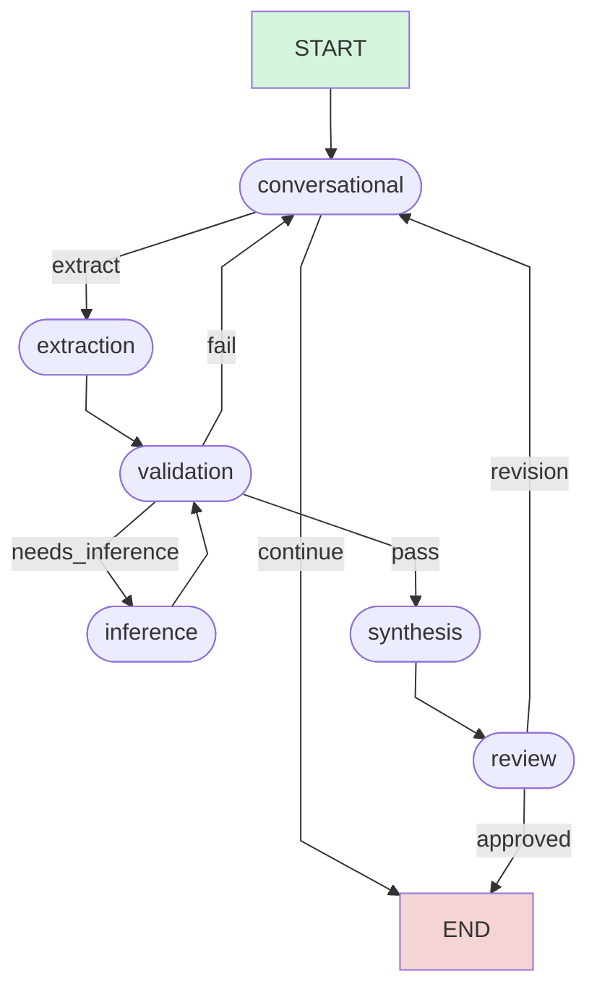

# User Story 4: LangGraph Orchestrator - Multi-Agent Workflow Coordination

## Story Overview

**Story ID:** STORY-004
**Story Title:** LangGraph Orchestrator Implementation - Agent Workflow State Machine
**Priority:** P0 - Critical (Enables Working Prototype)
**Estimated Effort:** 20-26 hours
**Sprint:** Sprint 4
**Dependencies:**
- STORY-001 (Project Foundation) - Complete ✅
- STORY-002 (Conversational Agent) - Complete ✅
- STORY-003 (Extraction Agent) - Complete ✅

---

## Socratic Design Questions & Answers

### Q1: What problem does the orchestrator solve?
**A:** Without an orchestrator, agents are isolated functions—they can't **coordinate**, can't **share context**, can't **decide who runs next**, and can't **recover from failures**. The orchestrator is the **conductor** of the agent symphony, managing:
- **Workflow**: Who runs when, and in what order?
- **State**: How is conversation context shared across agents?
- **Decisions**: When do we extract vs validate vs synthesize?
- **Recovery**: What happens when an agent fails?

### Q2: Why LangGraph specifically?
**A:** LangGraph solves three critical challenges:
1. **Stateful Orchestration**: Unlike simple chains, LangGraph maintains mutable state that flows through agents
2. **Conditional Branching**: Decisions like "if validation fails, return to conversation" are first-class
3. **Checkpointing**: State can be persisted and resumed (Redis/Postgres), enabling human-in-the-loop workflows

**Alternatives considered:**
- **LangChain Chains** - Too linear, no conditional branching
- **Custom State Machine** - Reinventing the wheel, no built-in checkpointing
- **Prefect/Airflow** - Too heavyweight for conversational AI, batch-oriented

### Q3: What is the "state" in our state machine?
**A:** The `GraphState` is a dictionary containing:
```python
GraphState = TypedDict('GraphState', {
    # Session context
    'session_id': str,
    'project_name': str,
    'user_id': str,

    # Conversation
    'chat_history': List[Message],
    'current_turn': int,

    # Requirements
    'requirements': List[RequirementItem],
    'inferred_requirements': List[RequirementItem],

    # Validation
    'validation_issues': List[Dict],
    'confidence': float,

    # RD Generation
    'rd_draft': Optional[str],
    'rd_version': int,

    # Review
    'approval_status': str,  # 'pending', 'approved', 'revision_requested'
    'review_feedback': Optional[str],

    # Orchestration metadata
    'last_agent': str,
    'iterations': int,
    'error_count': int,
})
```

**Key Insight**: State is **immutable per node**—each agent returns a new state dict that gets merged.

### Q4: What's the difference between a "node" and an "edge" in LangGraph?
**A:**
- **Node** = A function that transforms state (e.g., `conversational_node`, `extraction_node`)
- **Edge** = A transition rule (e.g., "after conversation, go to extraction if requirements detected")

**Two edge types:**
1. **Normal Edge**: Unconditional (always go from A → B)
2. **Conditional Edge**: Decision-based (go to B if X, else go to C)

### Q5: How do we decide which agent runs next?
**A:** Through **conditional routing functions**:
```python
def decide_next_step(state: GraphState) -> str:
    """Routes to next agent based on conversation state"""

    # Check if user explicitly said "generate document"
    last_message = state['chat_history'][-1].content.lower()
    if 'generate' in last_message or 'create document' in last_message:
        return 'extract'

    # Check if conversational agent flagged extraction readiness
    if state.get('next_action') == 'extract_requirements':
        return 'extract'

    # Check if we have requirements but not validated yet
    if len(state['requirements']) > 0 and not state.get('validated'):
        return 'validate'

    # Default: continue conversation
    return 'continue'
```

### Q6: What happens when an agent fails?
**A:** Three-tier error handling:
1. **Agent-level**: Agent catches error, returns degraded state with `error_count += 1`
2. **Orchestrator-level**: If `error_count >= 3`, route to human review node
3. **Checkpointing**: State is saved before each node, can reload from last good state

### Q7: How do we implement human-in-the-loop?
**A:** LangGraph's **interrupt** mechanism:
```python
# Before synthesis node, interrupt for human review
graph.add_node('human_review', interrupt=True)

# When graph hits this node, execution pauses
# Human can:
# 1. Approve → resume graph with updated state
# 2. Reject → modify state and resume
# 3. Cancel → terminate graph
```

### Q8: What is checkpointing and why is it critical?
**A:** **Checkpointing** = Persisting graph state at each node to Redis/Postgres.

**Why critical:**
- **Resume conversations**: User closes tab, comes back later → state restored
- **Human review cycles**: Pause for approval, resume days later
- **Error recovery**: Crash? Reload from last checkpoint
- **Audit trail**: Every state transition logged

**Implementation:**
```python
from langgraph.checkpoint.postgres import PostgresSaver

checkpointer = PostgresSaver(conn_string=DATABASE_URI)
graph = graph.compile(checkpointer=checkpointer)

# State automatically saved after each node
# Retrieve: graph.get_state(thread_id='session-123')
```

### Q9: How do we test the orchestrator?
**A:** Three test levels:
1. **Unit Tests**: Test individual routing functions
2. **Integration Tests**: Test node sequences (conversation → extraction → validation)
3. **End-to-End Tests**: Full conversation → RD generation → approval

**Key test case:**
```python
async def test_happy_path():
    state = initial_state()

    # Turn 1: User message
    state = await conversational_node(state)
    assert state['last_agent'] == 'conversational'

    # Turn 2: Extract requirements
    state = await extraction_node(state)
    assert len(state['requirements']) > 0

    # Turn 3: Validate
    state = await validation_node(state)
    assert state['confidence'] > 0.8

    # Turn 4: Synthesize RD
    state = await synthesis_node(state)
    assert state['rd_draft'] is not None
```

### Q10: What does a "working prototype" mean for this story?
**A:** A working prototype means:
1. **User can chat**: Send messages via API, get responses
2. **Requirements are extracted**: After sufficient conversation, automatic extraction
3. **RD is generated**: Extracted requirements → Markdown RD
4. **State persists**: Close browser, come back → conversation continues
5. **Visible workflow**: Logs show which agent runs when

**MVP Flow:**
```
User: "We need a login feature"
  → Conversational Node (ACK, ask clarification)

User: "Email and password, under 2 seconds"
  → Conversational Node (decides: ready for extraction)
  → Extraction Node (extracts 2 requirements)
  → Validation Node (checks quality)
  → Synthesis Node (generates RD draft)

User: "Approve"
  → Review Node (locks RD)
```

---

## Story Description

As a **platform architect**, I want to **implement the LangGraph orchestrator that coordinates all agents in a stateful workflow** so that **conversations flow naturally, requirements are extracted at the right time, validation triggers before synthesis, and the entire workflow can be paused/resumed for human review**.

This story implements the **orchestration backbone** of the platform. The orchestrator:

- Defines the agent workflow as a directed graph with conditional branches
- Manages shared state across all agent invocations
- Routes execution based on conversation context and confidence scores
- Persists checkpoints to Redis and Postgres for resumability
- Handles errors gracefully with fallback nodes
- Enables human-in-the-loop review at critical decision points
- Provides observability through LangSmith tracing

**Key Outcome**: After this story, you can **run a full conversation from start to RD generation** via the API, with state persisted across sessions.

---

## Business Value

- **Enables end-to-end workflow**: First time all agents work together in sequence
- **Reduces complexity**: Single orchestrator replaces ad-hoc agent coordination logic
- **Improves reliability**: Checkpointing enables crash recovery and session resume
- **Accelerates debugging**: LangSmith traces show exact agent execution flow
- **Enables scalability**: State machine pattern supports adding new agents without rewriting logic
- **Facilitates testing**: Each workflow path is independently testable

---

## Acceptance Criteria

### ✅ AC1: LangGraph Graph Definition

**Given** the orchestrator module
**When** I examine `src/orchestrator/graph.py`
**Then** a complete LangGraph workflow is defined:

**Graph Structure:**
```python
from langgraph.graph import StateGraph

# Define state schema
class GraphState(TypedDict):
    session_id: str
    chat_history: List[Message]
    requirements: List[RequirementItem]
    # ... (full schema from Q3)

# Create graph
workflow = StateGraph(GraphState)

# Add nodes (agents)
workflow.add_node('conversational', conversational_node)
workflow.add_node('extraction', extraction_node)
workflow.add_node('inference', inference_node)
workflow.add_node('validation', validation_node)
workflow.add_node('synthesis', synthesis_node)
workflow.add_node('review', review_node)

# Add edges
workflow.add_edge(START, 'conversational')
workflow.add_conditional_edges(
    'conversational',
    decide_next_step,
    {
        'extract': 'extraction',
        'continue': END,
        'validate': 'validation'
    }
)
workflow.add_edge('extraction', 'validation')
workflow.add_conditional_edges(
    'validation',
    validation_router,
    {
        'pass': 'synthesis',
        'fail': 'conversational',
        'needs_inference': 'inference'
    }
)
workflow.add_edge('synthesis', 'review')
workflow.add_conditional_edges(
    'review',
    review_router,
    {
        'approved': END,
        'revision': 'conversational'
    }
)

# Compile with checkpointing
graph = workflow.compile(checkpointer=PostgresSaver(...))
```

**Verification:**
```bash
python -c "from src.orchestrator.graph import graph; print(graph.get_graph().draw_ascii())"

# Expected ASCII visualization:
#  START
#    ↓
#  conversational
#    ↓ (conditional)
#  [extract / continue / validate]
#    ↓
#  extraction → validation
#    ↓ (conditional)
#  [pass → synthesis / fail → conversational]
#    ↓
#  review → [approved / revision]
#    ↓
#  END
```

---

### ✅ AC2: State Schema Implementation

**Given** the state module
**When** I examine `src/orchestrator/state.py`
**Then** complete GraphState TypedDict is defined:

**State Schema:**
```python
# src/orchestrator/state.py
from typing import TypedDict, List, Optional, Literal, Dict, Any
from datetime import datetime

class GraphState(TypedDict, total=False):
    # Required fields
    session_id: str
    project_name: str
    user_id: str

    # Conversation state
    chat_history: List[Dict[str, Any]]  # List of Message objects as dicts
    current_turn: int

    # Requirements tracking
    requirements: List[Dict[str, Any]]  # List of RequirementItem as dicts
    inferred_requirements: List[Dict[str, Any]]

    # Validation state
    validation_issues: List[Dict[str, Any]]
    confidence: float
    validated: bool

    # RD generation
    rd_draft: Optional[str]
    rd_version: int

    # Review state
    approval_status: Literal['pending', 'approved', 'revision_requested']
    review_feedback: Optional[str]

    # Orchestration metadata
    last_agent: str
    next_action: Optional[str]  # 'continue', 'extract', 'validate', 'synthesize'
    iterations: int
    error_count: int

    # Checkpointing metadata
    checkpoint_id: Optional[str]
    parent_checkpoint_id: Optional[str]

    # Timestamp
    last_updated: str  # ISO format datetime

def create_initial_state(
    session_id: str,
    project_name: str,
    user_id: str
) -> GraphState:
    """Create initial graph state for new session"""
    return GraphState(
        session_id=session_id,
        project_name=project_name,
        user_id=user_id,
        chat_history=[],
        current_turn=0,
        requirements=[],
        inferred_requirements=[],
        validation_issues=[],
        confidence=1.0,
        validated=False,
        rd_draft=None,
        rd_version=0,
        approval_status='pending',
        review_feedback=None,
        last_agent='system',
        next_action=None,
        iterations=0,
        error_count=0,
        checkpoint_id=None,
        parent_checkpoint_id=None,
        last_updated=datetime.utcnow().isoformat()
    )
```

**Verification:**
```python
from src.orchestrator.state import create_initial_state, GraphState

state = create_initial_state('sess-001', 'Test Project', 'user-123')
assert isinstance(state, dict)
assert state['session_id'] == 'sess-001'
assert state['current_turn'] == 0
assert len(state['requirements']) == 0
print("✅ State schema validation successful")
```

---

### ✅ AC3: Node Function Wrappers

**Given** agent implementations from Stories 2-3
**When** I examine `src/orchestrator/nodes.py`
**Then** all agents have LangGraph node wrappers:

**Node Wrapper Pattern:**
```python
# src/orchestrator/nodes.py
from src.agents.conversational.agent import ConversationalAgent
from src.agents.extraction.agent import ExtractionAgent
from src.orchestrator.state import GraphState
from src.utils.logging import get_logger, log_with_context
from datetime import datetime
import traceback

logger = get_logger(__name__)

# Initialize agents once (singleton pattern)
conversational_agent = ConversationalAgent()
extraction_agent = ExtractionAgent()

async def conversational_node(state: GraphState) -> GraphState:
    """
    LangGraph node wrapper for Conversational Agent

    Responsibilities:
    - Process user message
    - Generate assistant response
    - Decide next action (continue, extract, validate)
    """
    try:
        log_with_context(
            logger, 'info',
            'Conversational node started',
            session_id=state['session_id'],
            turn=state['current_turn']
        )

        # Invoke agent
        result = await conversational_agent.invoke(state)

        # Extract response
        assistant_message = {
            'id': f"msg-{datetime.utcnow().timestamp()}",
            'role': 'assistant',
            'content': result.get('message', ''),
            'timestamp': datetime.utcnow().isoformat(),
            'metadata': {
                'agent': 'conversational',
                'confidence': result.get('confidence', 0.0),
                'next_action': result.get('next_action', 'continue')
            }
        }

        # Update state
        updated_state = {
            **state,
            'chat_history': [*state['chat_history'], assistant_message],
            'confidence': result.get('confidence', state['confidence']),
            'next_action': result.get('next_action', 'continue'),
            'last_agent': 'conversational',
            'iterations': state['iterations'] + 1,
            'last_updated': datetime.utcnow().isoformat()
        }

        log_with_context(
            logger, 'info',
            'Conversational node completed',
            next_action=updated_state['next_action'],
            confidence=updated_state['confidence']
        )

        return updated_state

    except Exception as e:
        logger.error(f"Conversational node failed: {e}", exc_info=True)
        return {
            **state,
            'error_count': state['error_count'] + 1,
            'last_agent': 'conversational',
            'confidence': max(0.0, state['confidence'] - 0.2)
        }

async def extraction_node(state: GraphState) -> GraphState:
    """
    LangGraph node wrapper for Extraction Agent

    Responsibilities:
    - Extract structured requirements from chat
    - Store requirements in state
    - Calculate extraction confidence
    """
    try:
        log_with_context(
            logger, 'info',
            'Extraction node started',
            session_id=state['session_id'],
            existing_requirements=len(state['requirements'])
        )

        # Invoke agent
        result = await extraction_agent.invoke(state)

        # Update state with extracted requirements
        updated_state = {
            **state,
            'requirements': [*state['requirements'], *result.get('requirements', [])],
            'confidence': result.get('confidence', state['confidence']),
            'last_agent': 'extraction',
            'validated': False,  # New requirements need validation
            'iterations': state['iterations'] + 1,
            'last_updated': datetime.utcnow().isoformat()
        }

        log_with_context(
            logger, 'info',
            'Extraction node completed',
            extracted_count=len(result.get('requirements', [])),
            total_requirements=len(updated_state['requirements'])
        )

        return updated_state

    except Exception as e:
        logger.error(f"Extraction node failed: {e}", exc_info=True)
        return {
            **state,
            'error_count': state['error_count'] + 1,
            'last_agent': 'extraction'
        }

# Additional node wrappers for inference, validation, synthesis, review
# ... (similar pattern)
```

**Verification:**
```bash
uv run pytest tests/unit/orchestrator/test_nodes.py -v

# Expected:
# ✅ test_conversational_node_updates_state PASSED
# ✅ test_extraction_node_adds_requirements PASSED
# ✅ test_node_error_handling PASSED
```

---

### ✅ AC4: Conditional Routing Functions

**Given** the orchestrator module
**When** I examine routing logic
**Then** conditional edge functions correctly route execution:

**Routing Functions:**
```python
# src/orchestrator/routing.py
from src.orchestrator.state import GraphState
from typing import Literal

def decide_next_step(state: GraphState) -> str:
    """
    Route from conversational node to next step

    Decision logic:
    1. Check if error count too high → 'error_handler'
    2. Check if next_action explicitly set → follow it
    3. Check if user requested generation → 'extract'
    4. Check if enough conversation → 'extract'
    5. Default → 'continue' (return to END, wait for next user message)
    """

    # Error escalation
    if state.get('error_count', 0) >= 3:
        return 'error_handler'

    # Explicit next action from agent
    next_action = state.get('next_action')
    if next_action == 'extract_requirements':
        return 'extract'
    elif next_action == 'validate':
        return 'validate'
    elif next_action == 'synthesize':
        return 'synthesis'

    # Check user intent from last message
    if state['chat_history']:
        last_user_msg = [m for m in state['chat_history'] if m['role'] == 'user']
        if last_user_msg:
            content = last_user_msg[-1]['content'].lower()
            if any(keyword in content for keyword in ['generate', 'create document', 'show me', 'draft']):
                return 'extract'

    # Check if we have requirements but not yet validated
    if len(state.get('requirements', [])) > 0 and not state.get('validated', False):
        return 'validate'

    # Default: continue conversation (wait for next user input)
    return 'continue'

def validation_router(state: GraphState) -> str:
    """
    Route from validation node based on validation results

    Decision logic:
    1. If confidence < threshold → 'fail' (back to conversation)
    2. If validation issues exist → 'fail'
    3. If no inferred requirements generated yet → 'needs_inference'
    4. Otherwise → 'pass' (proceed to synthesis)
    """

    confidence = state.get('confidence', 0.0)
    issues = state.get('validation_issues', [])
    inferred = state.get('inferred_requirements', [])
    requirements = state.get('requirements', [])

    # Critical issues or low confidence
    if confidence < 0.60:
        return 'fail'

    if any(issue.get('severity') == 'critical' for issue in issues):
        return 'fail'

    # If we have requirements but no inferred ones yet, do inference
    if len(requirements) > 0 and len(inferred) == 0:
        return 'needs_inference'

    # Validation passed
    return 'pass'

def review_router(state: GraphState) -> str:
    """
    Route from review node based on approval status

    Decision logic:
    1. If approved → 'approved' (END)
    2. If revision requested → 'revision' (back to conversation)
    3. Otherwise → 'pending' (stay in review, wait for decision)
    """

    approval_status = state.get('approval_status', 'pending')

    if approval_status == 'approved':
        return 'approved'
    elif approval_status == 'revision_requested':
        return 'revision'
    else:
        return 'pending'  # Stay in review state

def should_continue_iteration(state: GraphState) -> bool:
    """
    Check if we should continue iterating or stop

    Safety limits:
    - Max 10 iterations per session
    - Max 5 errors
    """
    max_iterations = 10
    max_errors = 5

    if state.get('iterations', 0) >= max_iterations:
        return False

    if state.get('error_count', 0) >= max_errors:
        return False

    return True
```

**Verification:**
```bash
uv run pytest tests/unit/orchestrator/test_routing.py -v

# Expected:
# ✅ test_decide_next_step_with_explicit_action PASSED
# ✅ test_decide_next_step_from_user_intent PASSED
# ✅ test_validation_router_confidence_threshold PASSED
# ✅ test_validation_router_critical_issues PASSED
# ✅ test_review_router_approval PASSED
```

---

### ✅ AC5: Checkpointing Integration

**Given** PostgreSQL and Redis available
**When** I configure checkpointing
**Then** state persists across sessions:

**Checkpointing Setup:**
```python
# src/orchestrator/checkpointer.py
from langgraph.checkpoint.postgres import PostgresSaver
from langgraph.checkpoint.redis import RedisSaver
from src.config import settings
import asyncio

class DualCheckpointer:
    """
    Dual-layer checkpointing: Redis (fast) + Postgres (durable)

    Strategy:
    - Redis: Primary, fast access for active sessions (TTL: 1 hour)
    - Postgres: Secondary, durable storage for all sessions
    """

    def __init__(self):
        self.redis_saver = RedisSaver(settings.REDIS_URL)
        self.postgres_saver = PostgresSaver(settings.DATABASE_URI)

    async def save(self, config: dict, checkpoint: dict, metadata: dict):
        """Save checkpoint to both Redis and Postgres"""
        # Save to Redis (fast, for active sessions)
        await self.redis_saver.aput(config, checkpoint, metadata)

        # Save to Postgres (durable, for all sessions)
        await self.postgres_saver.aput(config, checkpoint, metadata)

    async def load(self, config: dict):
        """Load checkpoint, trying Redis first, fallback to Postgres"""
        # Try Redis first (fast)
        checkpoint = await self.redis_saver.aget(config)
        if checkpoint:
            return checkpoint

        # Fallback to Postgres
        checkpoint = await self.postgres_saver.aget(config)

        # Repopulate Redis if found in Postgres
        if checkpoint:
            await self.redis_saver.aput(config, checkpoint, {})

        return checkpoint

# Graph compilation with checkpointing
from src.orchestrator.graph import workflow

checkpointer = DualCheckpointer()
graph = workflow.compile(checkpointer=checkpointer)
```

**Usage Example:**
```python
# Invoke graph with thread_id for checkpointing
result = await graph.ainvoke(
    state,
    config={
        'configurable': {
            'thread_id': f"session-{session_id}",
            'checkpoint_id': f"checkpoint-{turn}"
        }
    }
)

# Retrieve saved state later
saved_state = await graph.aget_state(
    config={'configurable': {'thread_id': f"session-{session_id}"}}
)
```

**Verification:**
```bash
uv run pytest tests/integration/orchestrator/test_checkpointing.py -v

# Expected:
# ✅ test_checkpoint_saved_after_node PASSED
# ✅ test_checkpoint_restored_on_resume PASSED
# ✅ test_redis_fallback_to_postgres PASSED
```

---

### ✅ AC6: Graph Compilation and Execution

**Given** all nodes and edges defined
**When** I compile and execute the graph
**Then** agents run in correct sequence:

**Complete Graph Definition:**
```python
# src/orchestrator/graph.py
from langgraph.graph import StateGraph, END, START
from src.orchestrator.state import GraphState
from src.orchestrator.nodes import (
    conversational_node,
    extraction_node,
    inference_node,
    validation_node,
    synthesis_node,
    review_node
)
from src.orchestrator.routing import (
    decide_next_step,
    validation_router,
    review_router
)
from src.orchestrator.checkpointer import DualCheckpointer

def build_graph() -> StateGraph:
    """Build and compile the requirements engineering workflow graph"""

    # Create workflow with state schema
    workflow = StateGraph(GraphState)

    # Add nodes
    workflow.add_node('conversational', conversational_node)
    workflow.add_node('extraction', extraction_node)
    workflow.add_node('inference', inference_node)
    workflow.add_node('validation', validation_node)
    workflow.add_node('synthesis', synthesis_node)
    workflow.add_node('review', review_node)

    # Set entry point
    workflow.set_entry_point('conversational')

    # Add conditional edges from conversational
    workflow.add_conditional_edges(
        'conversational',
        decide_next_step,
        {
            'extract': 'extraction',
            'validate': 'validation',
            'synthesis': 'synthesis',
            'continue': END
        }
    )

    # Extraction always goes to validation
    workflow.add_edge('extraction', 'validation')

    # Conditional edges from validation
    workflow.add_conditional_edges(
        'validation',
        validation_router,
        {
            'pass': 'synthesis',
            'fail': 'conversational',
            'needs_inference': 'inference'
        }
    )

    # Inference loops back to validation
    workflow.add_edge('inference', 'validation')

    # Synthesis goes to review
    workflow.add_edge('synthesis', 'review')

    # Conditional edges from review
    workflow.add_conditional_edges(
        'review',
        review_router,
        {
            'approved': END,
            'revision': 'conversational',
            'pending': END  # Wait for human decision
        }
    )

    # Compile with checkpointing
    checkpointer = DualCheckpointer()
    graph = workflow.compile(checkpointer=checkpointer)

    return graph

# Singleton graph instance
graph = build_graph()
```

**Verification:**
```python
from src.orchestrator.graph import graph

# Print graph structure
print(graph.get_graph().draw_ascii())

# Expected output:
#        +-----------+
#        |   START   |
#        +-----------+
#              *
#              *
#              *
#     +----------------+
#     | conversational |
#     +----------------+
#        **         **
#      **             **
#    **                 **
# +-----------+    +---------+
# | extraction|    |   END   |
# +-----------+    +---------+
#        *
#        *
#        *
# +------------+
# | validation |----+
# +------------+    |
#   *        *     |
#  *          *    |
# *            *   |
# +----------+  +----------+
# | synthesis|  | inference|
# +----------+  +----------+
#      *             *
#      *             *
#      *             *
#   +--------+       *
#   | review |<------+
#   +--------+
#    *      *
#   *        *
#  *          *
# +------+  +-----------+
# | END  |  |conversational|
# +------+  +-----------+
```

---

### ✅ AC7: API Integration

**Given** FastAPI application from Story 1
**When** I integrate the orchestrator
**Then** API endpoints trigger graph execution:

**API Route Integration:**
```python
# src/api/routes/sessions.py
from fastapi import APIRouter, HTTPException, Depends
from src.orchestrator.graph import graph
from src.orchestrator.state import create_initial_state, GraphState
from src.schemas.api import SendMessageRequest, ChatMessageResponse
from src.storage.state_manager import StateManager
from src.utils.logging import get_logger
from uuid import uuid4

router = APIRouter()
logger = get_logger(__name__)
state_manager = StateManager()

@router.post('/{session_id}/messages', response_model=ChatMessageResponse)
async def send_message(
    session_id: str,
    request: SendMessageRequest,
    user_id: str = Depends(get_current_user)
):
    """
    Send message to orchestrator and get response

    Workflow:
    1. Load session state (from checkpoint or DB)
    2. Add user message to state
    3. Invoke LangGraph with updated state
    4. Save resulting state
    5. Return assistant response
    """
    try:
        # Load existing state or create new
        state = await state_manager.load_session_state(session_id)
        if not state:
            state = create_initial_state(session_id, 'New Project', user_id)

        # Add user message to state
        user_message = {
            'id': str(uuid4()),
            'role': 'user',
            'content': request.message,
            'timestamp': datetime.utcnow().isoformat(),
            'metadata': {}
        }
        state['chat_history'].append(user_message)
        state['current_turn'] += 1

        # Invoke graph
        logger.info(f"Invoking graph for session {session_id}, turn {state['current_turn']}")

        result = await graph.ainvoke(
            state,
            config={
                'configurable': {
                    'thread_id': f"session-{session_id}",
                    'checkpoint_id': f"turn-{state['current_turn']}"
                }
            }
        )

        # Save state
        await state_manager.save_session_state(session_id, result)

        # Extract assistant response
        assistant_messages = [
            m for m in result['chat_history']
            if m['role'] == 'assistant' and m['id'] not in [msg['id'] for msg in state['chat_history']]
        ]

        if not assistant_messages:
            raise HTTPException(500, "No assistant response generated")

        latest_message = assistant_messages[-1]

        return ChatMessageResponse(
            id=latest_message['id'],
            role=latest_message['role'],
            content=latest_message['content'],
            timestamp=latest_message['timestamp'],
            agent_metadata={
                'confidence': result.get('confidence', 0.0),
                'requirements_extracted': len(result.get('requirements', [])),
                'next_action': result.get('next_action'),
                'last_agent': result.get('last_agent')
            }
        )

    except Exception as e:
        logger.error(f"Error processing message for session {session_id}: {e}", exc_info=True)
        raise HTTPException(500, f"Failed to process message: {str(e)}")
```

**Verification:**
```bash
# Start server
uv run uvicorn src.main:app --reload &

# Send test message
curl -X POST http://localhost:8000/api/v1/sessions/test-123/messages \
  -H "Content-Type: application/json" \
  -H "Authorization: Bearer test-token" \
  -d '{"message": "We need a login feature with email and password"}'

# Expected response:
{
  "id": "msg-xyz",
  "role": "assistant",
  "content": "Great! I've captured that. Can you specify any performance requirements?",
  "timestamp": "2025-11-16T20:00:00Z",
  "agent_metadata": {
    "confidence": 0.85,
    "requirements_extracted": 1,
    "next_action": "continue",
    "last_agent": "conversational"
  }
}
```

---

### ✅ AC8: State Persistence and Resume

**Given** a session with saved checkpoints
**When** user resumes after hours
**Then** conversation continues seamlessly:

**State Manager Implementation:**
```python
# src/storage/state_manager.py
from src.orchestrator.state import GraphState
from src.orchestrator.graph import graph
from typing import Optional
import json

class StateManager:
    """Manages loading and saving session state"""

    async def load_session_state(self, session_id: str) -> Optional[GraphState]:
        """
        Load session state with fallback strategy:
        1. Try LangGraph checkpoint (Redis/Postgres)
        2. Fallback to rebuilding from DB
        """
        try:
            # Try LangGraph checkpoint first
            config = {'configurable': {'thread_id': f"session-{session_id}"}}
            checkpoint = await graph.aget_state(config)

            if checkpoint and checkpoint.values:
                return checkpoint.values

            # Fallback: rebuild from database
            return await self._rebuild_state_from_db(session_id)

        except Exception as e:
            logger.error(f"Failed to load state for {session_id}: {e}")
            return None

    async def save_session_state(self, session_id: str, state: GraphState):
        """
        Save session state to all layers:
        1. LangGraph checkpoint (automatic via compiled graph)
        2. Database (explicit persistence)
        """
        try:
            # Checkpointing is automatic via LangGraph
            # But we also persist critical data to DB for recovery

            # Save requirements to DB
            if state.get('requirements'):
                await self._persist_requirements(session_id, state['requirements'])

            # Save RD draft to DB
            if state.get('rd_draft'):
                await self._persist_rd_draft(session_id, state['rd_draft'], state['rd_version'])

            # Update session metadata
            await self._update_session_metadata(session_id, state)

        except Exception as e:
            logger.error(f"Failed to save state for {session_id}: {e}")
            raise

    async def _rebuild_state_from_db(self, session_id: str) -> GraphState:
        """Rebuild state from database (disaster recovery)"""
        # Load from DB: session, messages, requirements, RD
        # Reconstruct GraphState
        # This is the last-resort fallback
        pass
```

**Verification:**
```bash
uv run pytest tests/integration/orchestrator/test_state_persistence.py -v

# Expected:
# ✅ test_state_persists_across_turns PASSED
# ✅ test_state_resume_after_delay PASSED
# ✅ test_state_recovery_from_database PASSED
```

---

### ✅ AC9: Error Handling and Recovery

**Given** agents that can fail
**When** errors occur during execution
**Then** orchestrator handles gracefully:

**Error Handling Strategy:**
```python
# src/orchestrator/nodes.py (additions)

async def error_handler_node(state: GraphState) -> GraphState:
    """
    Special node for handling errors

    Responsibilities:
    - Log error details
    - Attempt recovery strategies
    - Escalate to human if unrecoverable
    """
    logger.error(
        f"Error handler invoked for session {state['session_id']}",
        extra={
            'error_count': state['error_count'],
            'last_agent': state['last_agent'],
            'iterations': state['iterations']
        }
    )

    # Add system message explaining error
    error_message = {
        'id': f"msg-error-{datetime.utcnow().timestamp()}",
        'role': 'system',
        'content': "I encountered some technical difficulties. Let me try a different approach.",
        'timestamp': datetime.utcnow().isoformat(),
        'metadata': {'type': 'error_recovery'}
    }

    # Reset error count (give another chance)
    return {
        **state,
        'chat_history': [*state['chat_history'], error_message],
        'error_count': 0,  # Reset for fresh start
        'last_agent': 'error_handler',
        'next_action': 'continue'  # Return to conversation
    }

# Add error handler node to graph
workflow.add_node('error_handler', error_handler_node)
workflow.add_edge('error_handler', 'conversational')
```

**Verification:**
```bash
uv run pytest tests/integration/orchestrator/test_error_handling.py -v

# Expected:
# ✅ test_error_recovery_after_agent_failure PASSED
# ✅ test_error_escalation_after_max_retries PASSED
# ✅ test_checkpoint_rollback_on_error PASSED
```

---

### ✅ AC10: Observability with LangSmith

**Given** LangSmith configured
**When** I run the orchestrator
**Then** full execution trace is visible:

**LangSmith Integration:**
```python
# src/orchestrator/graph.py (additions)
import os
from langsmith import traceable

# Enable tracing
os.environ['LANGSMITH_TRACING'] = 'true'
os.environ['LANGSMITH_PROJECT'] = 'req-eng-orchestrator'

# Wrap graph invocation with tracing
@traceable(name='orchestrator_execution')
async def invoke_graph_with_tracing(state: GraphState, config: dict) -> GraphState:
    """Wrapper for graph invocation with LangSmith tracing"""
    result = await graph.ainvoke(state, config)
    return result
```

**Trace Attributes to Log:**
- Session ID
- Turn number
- Nodes executed (in order)
- Routing decisions made
- Agent confidence scores
- Errors encountered
- Execution time per node
- Total execution time

**Verification:**
```bash
# Run conversation
uv run python scripts/test_orchestrator.py

# Check LangSmith dashboard
# Navigate to: https://smith.langchain.com
# Expected: Trace showing full execution graph with timing
```

---

### ✅ AC11: End-to-End Integration Test

**Given** complete orchestrator setup
**When** I run full conversation workflow
**Then** all agents execute in correct sequence:

**E2E Test:**
```python
# tests/e2e/test_full_workflow.py
import pytest
from src.orchestrator.graph import graph
from src.orchestrator.state import create_initial_state

@pytest.mark.asyncio
async def test_full_conversation_to_rd():
    """Test complete workflow from conversation to RD generation"""

    # Initialize state
    state = create_initial_state('e2e-session', 'E-commerce App', 'user-test')

    # Turn 1: Initial greeting
    state['chat_history'].append({
        'id': 'msg-1',
        'role': 'user',
        'content': 'We need a mobile e-commerce app',
        'timestamp': '2025-11-16T20:00:00Z'
    })
    state['current_turn'] = 1

    result = await graph.ainvoke(state, config={'configurable': {'thread_id': 'e2e-session'}})

    assert result['last_agent'] == 'conversational'
    assert len(result['chat_history']) > 1

    # Turn 2: Provide requirements
    result['chat_history'].append({
        'id': 'msg-3',
        'role': 'user',
        'content': 'Users should log in with email and password. Load time under 2 seconds.',
        'timestamp': '2025-11-16T20:01:00Z'
    })
    result['current_turn'] = 2

    result = await graph.ainvoke(result, config={'configurable': {'thread_id': 'e2e-session'}})

    # Should have extracted requirements
    assert len(result['requirements']) >= 2
    assert result['last_agent'] in ['extraction', 'validation', 'conversational']

    # Turn 3: Request generation
    result['chat_history'].append({
        'id': 'msg-5',
        'role': 'user',
        'content': 'Generate the requirements document',
        'timestamp': '2025-11-16T20:02:00Z'
    })
    result['current_turn'] = 3

    result = await graph.ainvoke(result, config={'configurable': {'thread_id': 'e2e-session'}})

    # Should have synthesized RD
    assert result['rd_draft'] is not None
    assert len(result['rd_draft']) > 0
    assert 'REQ-001' in result['rd_draft'] or 'REQ-002' in result['rd_draft']
    assert result['last_agent'] in ['synthesis', 'review']

    print(f"✅ Full workflow completed successfully")
    print(f"   - Requirements extracted: {len(result['requirements'])}")
    print(f"   - RD version: {result['rd_version']}")
    print(f"   - Final confidence: {result['confidence']:.2f}")
```

**Verification:**
```bash
uv run pytest tests/e2e/test_full_workflow.py -v -s

# Expected output:
# ✅ Full workflow completed successfully
#    - Requirements extracted: 2
#    - RD version: 1
#    - Final confidence: 0.85
# PASSED
```

---

### ✅ AC12: Graph Visualization

**Given** compiled graph
**When** I generate visualization
**Then** workflow is clearly illustrated:

**Visualization Tools:**
```python
# scripts/visualize_graph.py
from src.orchestrator.graph import graph
import matplotlib.pyplot as plt

# ASCII visualization (for CLI)
print(graph.get_graph().draw_ascii())

# Mermaid diagram (for documentation)
mermaid = graph.get_graph().draw_mermaid()
with open('docs/orchestrator-flow.mmd', 'w') as f:
    f.write(mermaid)

print("✅ Graph visualizations generated")
print("   - ASCII: printed above")
print("   - Mermaid: docs/orchestrator-flow.mmd")
```

**Expected Mermaid Output:**


**Verification:**
```bash
uv run python scripts/visualize_graph.py

# Expected: ASCII art + Mermaid file created
```

---

## Technical Implementation Summary

### Core Files Created

| File | Lines | Purpose |
|------|-------|---------|
| `src/orchestrator/graph.py` | 150+ | Graph definition and compilation |
| `src/orchestrator/state.py` | 100+ | GraphState schema and initialization |
| `src/orchestrator/nodes.py` | 400+ | Node wrappers for all agents |
| `src/orchestrator/routing.py` | 200+ | Conditional routing functions |
| `src/orchestrator/checkpointer.py` | 100+ | Dual-layer checkpointing |
| `src/storage/state_manager.py` | 250+ | State persistence and recovery |
| `src/api/routes/sessions.py` | 200+ | API integration with orchestrator |

---

## Testing Strategy

### Unit Tests (20+ tests)
- State initialization
- Node wrapper functionality
- Routing function logic
- Error handling behavior

### Integration Tests (15+ tests)
- Multi-node execution sequences
- Checkpointing and resume
- State persistence across layers
- Error recovery workflows

### End-to-End Tests (5+ tests)
- Full conversation → RD generation
- Human-in-the-loop approval flow
- Multi-session concurrency
- Failure and recovery scenarios

---

## Definition of Done

- [ ] All 12 acceptance criteria passed and verified
- [ ] LangGraph workflow compiles without errors
- [ ] GraphState schema complete with all required fields
- [ ] All agent node wrappers implemented
- [ ] Conditional routing functions working correctly
- [ ] Checkpointing configured for Redis and Postgres
- [ ] API integration complete (send message triggers graph)
- [ ] State persistence works across sessions
- [ ] Error handling and recovery functional
- [ ] LangSmith tracing enabled and visible
- [ ] End-to-end test passes (conversation → RD)
- [ ] Graph visualization generated
- [ ] Unit tests: 100% pass rate (20+ tests)
- [ ] Integration tests: 100% pass rate (15+ tests)
- [ ] E2E tests: 100% pass rate (5+ tests)
- [ ] Code follows conventions (Black, Ruff, MyPy)
- [ ] Documentation complete with workflow diagrams

---

## Working Prototype Demo

After completing this story, you can demonstrate:

```bash
# Terminal 1: Start server
docker-compose up -d
uv run uvicorn src.main:app --reload

# Terminal 2: Run conversation
curl -X POST http://localhost:8000/api/v1/sessions \
  -H "Content-Type: application/json" \
  -d '{"project_name": "E-commerce App", "user_id": "demo-user"}'
# Response: {"id": "sess-abc123", ...}

# Send message 1
curl -X POST http://localhost:8000/api/v1/sessions/sess-abc123/messages \
  -H "Content-Type: application/json" \
  -d '{"message": "We need user login with email and password"}'
# Response: Assistant asks clarifying questions

# Send message 2
curl -X POST http://localhost:8000/api/v1/sessions/sess-abc123/messages \
  -H "Content-Type: application/json" \
  -d '{"message": "Login should complete in under 2 seconds on 4G"}'
# Response: Assistant acknowledges

# Send message 3: Trigger generation
curl -X POST http://localhost:8000/api/v1/sessions/sess-abc123/messages \
  -H "Content-Type: application/json" \
  -d '{"message": "Generate requirements document"}'
# Response: RD draft with extracted requirements

# Get RD
curl http://localhost:8000/api/v1/rd/sess-abc123
# Response: Full markdown RD with REQ-001, REQ-002, etc.
```

---

## Dependencies for Next Stories

Once Story 4 is complete:

- **STORY-005:** Inference Agent (can now run in workflow)
- **STORY-006:** Validation Agent Enhancements
- **STORY-007:** Synthesis Agent with Templates
- **STORY-008:** Frontend UI (connects to working backend)

---

## Notes for Windsurf AI Implementation

### Key Implementation Priorities

1. **Start with state schema** - Foundation for everything
2. **Build simple node wrappers** - One agent at a time
3. **Add basic routing** - Start with simple paths, add complexity later
4. **Integrate checkpointing early** - Critical for testing
5. **Test node-by-node** - Don't wait until full graph to test
6. **Add API integration last** - After graph works standalone

### Critical Design Decisions

**Q: Why TypedDict over Pydantic for GraphState?**
**A:** LangGraph requires TypedDict for state schema. Pydantic models used for inputs/outputs, but state itself must be TypedDict for graph framework compatibility.

**Q: How to handle async operations in nodes?**
**A:** All node functions are async. LangGraph automatically handles async execution. Use `await` for agent invocations, database calls, etc.

**Q: What if two users message simultaneously?**
**A:** Each session has unique `thread_id`. LangGraph checkpointing uses thread_id as isolation key. No conflicts.

**Q: How to debug graph execution?**
**A:** Three tools:
1. LangSmith traces (visual workflow)
2. Structured logs (text-based flow)
3. Graph.get_state() (inspect state at any point)

### Testing Execution

```bash
# Test state schema
uv run pytest tests/unit/orchestrator/test_state.py -v

# Test individual nodes
uv run pytest tests/unit/orchestrator/test_nodes.py -v

# Test routing logic
uv run pytest tests/unit/orchestrator/test_routing.py -v

# Test full graph
uv run pytest tests/integration/orchestrator/test_graph.py -v

# Test end-to-end
uv run pytest tests/e2e/test_full_workflow.py -v -s

# Run all orchestrator tests
uv run pytest tests/unit/orchestrator tests/integration/orchestrator tests/e2e -v
```

### Common Pitfalls to Avoid

- ❌ Don't mutate state directly - return new dict
- ❌ Don't forget to update `last_agent` and `iterations`
- ❌ Don't skip checkpointing config - critical for resume
- ❌ Don't ignore error handling - agents WILL fail
- ❌ Don't hardcode routing logic - use functions for testability
- ❌ Don't skip LangSmith - debugging without it is painful
- ❌ Don't forget `await` on async functions - graph will hang

### Performance Considerations

- **Node execution**: Each node takes 500ms-2s (LLM latency)
- **Checkpointing overhead**: Redis save ~10ms, Postgres ~50ms
- **Total turn latency**: 2-5 seconds for typical flow
- **Optimization**: Cache prompt templates, reuse agent instances

---

## References

- **LangGraph Documentation**: https://langchain-ai.github.io/langgraph/
- **LangGraph Checkpointing**: https://langchain-ai.github.io/langgraph/how-tos/persistence/
- **LangGraph Multi-Agent**: https://langchain-ai.github.io/langgraph/tutorials/multi_agent/
- **Story 1**: Project Foundation
- **Story 2**: Conversational Agent (provides node)
- **Story 3**: Extraction Agent (provides node)
- **Design Packet 2**: Section 7 - Orchestrator Deep Design

---

**End of Story 4 Document**

**Next Steps:**
1. Implement GraphState schema with all fields
2. Create node wrappers for existing agents
3. Build basic routing functions
4. Compile graph with simple flow (conversation → extraction)
5. Add checkpointing configuration
6. Integrate with API endpoints
7. Test end-to-end conversation flow
8. Add advanced routing (validation, synthesis paths)
9. Implement error handling and recovery
10. Enable LangSmith tracing for visibility

**Milestone**: After this story, you have a **working prototype** you can demo to stakeholders!
